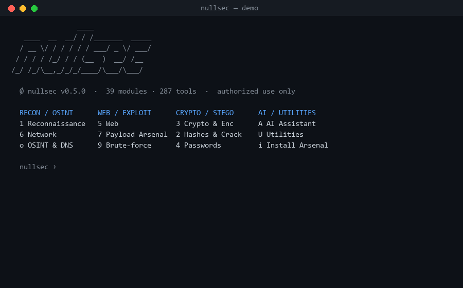
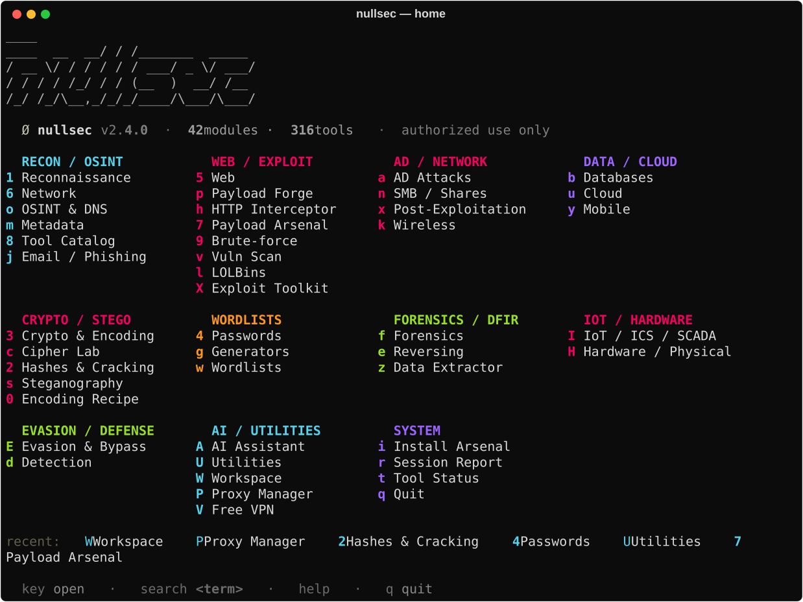
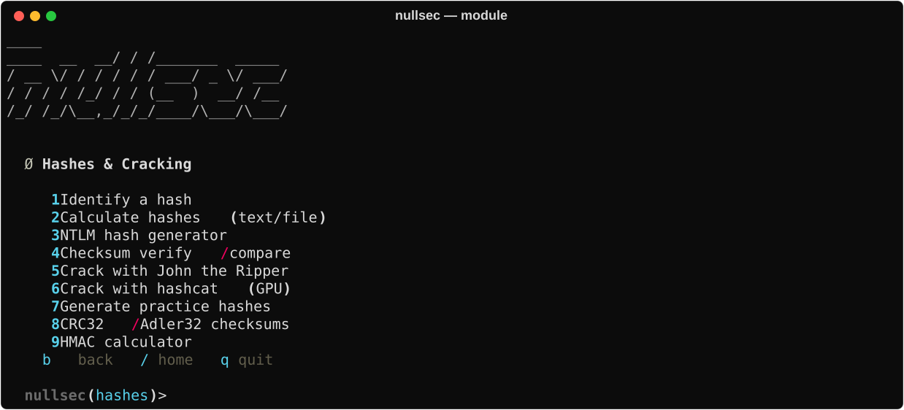
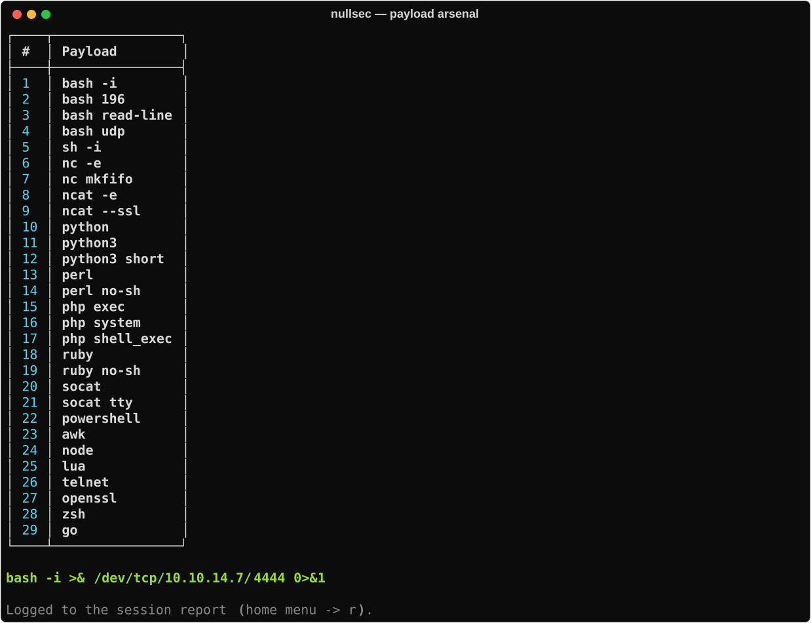

<div align="center">


# nullsec

**A menu-driven offensive-security multitool — 42 modules and 317 built-in tools behind one prompt.**

Recon · password cracking · crypto & cipher breaking · web/API testing · forensics · steganography · OSINT · evasion · payload generation — most of it pure Python with no setup.

[](https://github.com/fsiuhgshiqoih32/NullsecMultitools/actions/workflows/ci.yml)
[](https://github.com/fsiuhgshiqoih32/NullsecMultitools/releases/latest)
[](https://github.com/fsiuhgshiqoih32/NullsecMultitools/releases)


[](LICENSE)


</div>

<div align="center">



</div>

Most of nullsec runs on **pure Python** (just `rich` + `requests`). Heavier external
tools — `nmap`, `sqlmap`, `hydra`, `nuclei`, `metasploit`, `john`, `hashcat` — light
up automatically once they're installed, **natively or through WSL**. Nothing is
required to start: missing tools simply grey out their module and the built-in
scanners/crackers keep working.

- **42 modules · 317 built-in tools** — including a built-in **AI assistant** (local Ollama or any OpenAI-compatible endpoint)
- **Auto-install**: missing Python dependencies install themselves on first run; the AI tab can auto-install Ollama + a model
- **Windows auto-setup**: on launch it elevates (one UAC prompt) and adds a Defender exclusion so the payload data isn't quarantined — the Payload Arsenal just works
- **2,964** curated tools in the searchable catalog
- **~60,900** exploit/template modules reachable once Exploit-DB, Nuclei, and Metasploit are installed
- **71** ready-to-fill reverse/bind/web-shell payloads + msfvenom builders
- **1,000,000 most-common passwords** bundled — instant offline breach lookup (is a password in the top-1M, and at what rank?) and the default wordlist for the John/hashcat crackers
- Session reporting to Markdown/HTML, a CyberChef-style transform pipeline, and a WSL bridge for Linux-only tools

---

## Screenshots

<div align="center">

**Home** — every module one keystroke away



**Modules & tools** — a module menu, and the Payload Arsenal building a reverse shell

&nbsp;&nbsp;

</div>

---

## Highlights

**🔐 Built-in breach lookup (1,000,000 passwords).** The top-1M most-used passwords
ship with nullsec, so the Passwords module can tell you *instantly, offline* whether
a password is in public breach corpora and exactly how common it is — `123456` is
`#1`, `password` is `#2`, `P@ssw0rd` is `#15,585`. The same list is the default
wordlist for the John and hashcat crackers, so dictionary attacks work out of the box.

**🤖 AI assistant.** A first-class module that streams from a **local Ollama** model
(auto-picks the fastest one, auto-installs on demand) or any OpenAI-compatible API.
Chat, explain a command or error, suggest next steps from your recon notes, or paste
output to analyze — answers render as Markdown with proper code blocks.

**💣 Payload Arsenal.** 71 ready-to-fill reverse/bind/web shells (bash, python, PHP,
PowerShell, socat, …) plus msfvenom builders — pick one, drop in your LHOST/LPORT,
and copy. PowerShell shells even get a `-enc` base64 one-liner generated automatically.

**⚙️ It just works on Windows.** First launch elevates once (UAC) and adds a Defender
exclusion so the payload data isn't quarantined, missing Python deps install
themselves, and the whole thing runs as a single self-contained exe.

**🧰 42 modules of tooling** — from recon, web/API testing, and hash cracking to
forensics, steganography, evasion, a Utilities tab, persistent **Workspaces** for
engagements, and a **Proxy Manager** that routes every module's requests.

---

## Quick start

```bash
pip install -r requirements.txt
python main.py
```

Optional extras unlock a few more tools and **degrade gracefully** when absent
(`cryptography` → AES/RSA lab, `pillow` → PNG/EXIF stego, `pyfiglet` → the banner).

### Prebuilt Windows executable

Don't want Python? Build a standalone, self-contained `nullsec.exe` (bundles the
icon, catalog, and payloads — runs on any 64-bit Windows):

```bash
pyinstaller nullsec.spec --clean --noconfirm
# → dist/nullsec.exe
```

> The exe is unsigned, so Windows SmartScreen shows a warning on first run —
> **More info → Run anyway**, or right-click → Properties → **Unblock**.

---

## Usage

At the home prompt, press a module's key to open it, or use a command:

| Command | Does |
|---|---|
| `<key>` | open a module (e.g. `1`, `c`, `o`, `w`) — **keys are case-sensitive** (`E`=Evasion, `e`=Reversing) |
| `search <term>` | search the catalog + every module's tools, then jump straight in |
| `use <tool>` | show a catalogued tool's install command and details |
| `r` / `t` | session report · external-tool status |
| `help` / `?` | command help |
| `q` | quit |

Findings from recon/web/network modules collect in the **session report** (`r`),
which you can save as Markdown or a styled HTML page.

See **[USAGE.md](USAGE.md)** for a full walkthrough.

---

## Modules

| Group | Modules |
|---|---|
| **Recon / OSINT** | Reconnaissance · Network · OSINT & DNS · Metadata · Tool Catalog · Email / Phishing |
| **Web / Exploit** | Web · Payload Forge · HTTP Interceptor · Payload Arsenal · Brute-force · Vuln Scan · LOLBins · Exploit Toolkit |
| **AD / Network** | AD Attacks · SMB / Shares · Post-Exploitation · Wireless |
| **Data / Cloud** | Databases · Cloud · Mobile |
| **Crypto / Stego** | Crypto & Encoding · Cipher Lab · Hashes & Cracking · Steganography · Encoding Recipe |
| **Wordlists** | Passwords · Generators · Wordlists |
| **Forensics / DFIR** | Forensics · Reversing · Data Extractor |
| **IoT / Hardware** | IoT / ICS / SCADA · Hardware / Physical |
| **Evasion / Defense** | Evasion & Bypass · Detection |
| **AI** | AI Assistant — chat · explain · suggest next steps · analyze output (Ollama / OpenAI) |
| **Utilities** | Base converter · subnet/CIDR calc · epoch · UUID · secure passgen · URL dissector · entropy · JSON |
| **Workspace** | Named engagements — persist findings/notes, auto-capture from the reporter, Markdown/HTML export |
| **Proxy Manager** | Load/test/rotate proxies (HTTP/SOCKS), latency, keep-working, export; feeds every module's requests |
| **Free VPN** | Fetch free VPNGate relays by country, rank by speed, export OpenVPN configs, connect |
| **System** | Install Arsenal |

---

## How it fits together

- **`main.py`** draws the home grid and dispatches to modules.
- **`toolkit/*.py`** — one file per module, each exposing a `MENU` dict of `(label, function)`.
- **`toolkit/utils.py`** — shared console, the WSL bridge, external-tool detection, and the session reporter.
- **`toolkit/arsenal.dat`** — the base64 payload dataset (regenerate with `python tools/gen_arsenal.py`).
- **`data/tools.json`** — the importable tool catalog.

Run the smoke tests after changes:

```bash
python tests/test_smoke.py
```

---

## ⚠️ Legal

nullsec is for **authorized use only** — your own machines, lab VMs, and
CTF / training targets, or systems you have **explicit written permission** to test.
Unauthorized access to computer systems is illegal. You are solely responsible for
how you use this software. The authors accept no liability for misuse.

## License

[MIT](LICENSE) © 2026 anonymous
